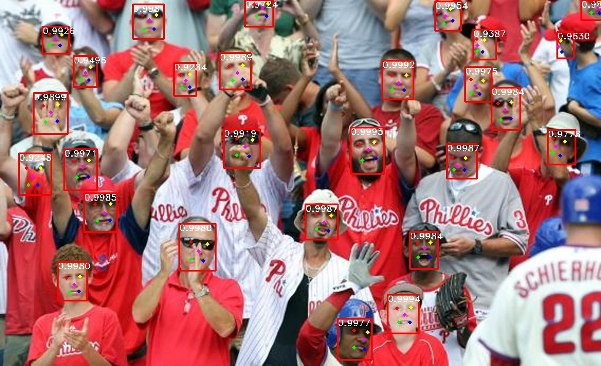

# 📸 RetinaFace: Single-stage Dense Face Localisation in the Wild | PyTorch 🎯

## 🔜 Soon weights will be released!!!

 [](https://github.com/yakhyo/retinaface-pytorch)

This is a face detection model for high-precision facial localization based on [RetinaFace: Single-stage Dense Face Localisation in the Wild](https://arxiv.org/abs/1905.00641). This model accurately detects facial landmarks and bounding boxes for faces in images. This repository provides custom training & inference code, and several new backbone models have been integrated for improved performance and flexibility.

<div align="center">

</div>

In this implementation, we use several lightweight and powerful backbone architectures to provide flexibility between performance and accuracy.

## 📈 Results

| Retinaface Feature Extractors         | Pretrain | Easy   | Medium | Hard   | #Params (M) | #Flops (G) | Infer (ms) |
| ------------------------------------- | -------- | ------ | ------ | ------ | ----------- | ---------- | ---------- |
| MobileNetV1 (MXNet image scale)       | False    | 92.66% | 91.71% | 87.11% |             |            |            |
| MobileNetV1 (original image size)     | False    | 95.35% | 93.82% | 67.27% |             |            |            |
| MobileNetV1_025 (MXNet image scale)   | False    | 90.09% | 88.32% | 81.98% |             |            |            |
| MobileNetV1_025 (original image size) | False    | 91.99% | 89.78% | 61.22% |             |            |            |
| MobileNetV1_050 (MXNet image scale)   | False    | 91.88% | 90.56% | 85.53% |             |            |            |
| MobileNetV1_050 (original image size) | False    | 94.00% | 92.57% | 65.51% |             |            |            |
| MobileNetV2                           | True     |        |        |        |             |            |            |
| ResNet18 (MXNet image scale)          | True     | 93.00% | 92.33% | 87.99% |             |            |            |
| ResNet18 (original image size)        | True     | 95.68% | 94.43% | 67.90% |             |            |            |
| ResNet34                              | True     |        |        |        |             |            |            |
| ResNet50                              | True     |        |        |        |             |            |            |

## ✨ Features

- ✅ **Cleaner & Reproducible Code**: Refactored for simplicity and consistency, making it easier to use and maintain.
- 📱 **MobileNetV1_0.25 & MobileNetV1_0.50**: Lightweight versions for faster inference with reduced computational cost.
- 📲 **MobileNetV1**: [Efficient Convolutional Neural Networks for Mobile Vision Applications](https://arxiv.org/abs/1704.04861) - Optimized for mobile and low-power applications.
- 📈 **MobileNetV2**: [Inverted Residuals and Linear Bottlenecks](https://arxiv.org/abs/1801.04381) - Improved efficiency for mobile use-cases with advanced architecture.
- 🔍 **ResNet Models (18, 34, 50)**: [Deep Residual Networks](https://arxiv.org/abs/1512.03385) - Enhanced accuracy with deeper residual connections, supporting a range of model complexities.

### 📅 Last Updated: October 27, 2024

## ⚙️ Installation

1. **Clone the repository**:

   ```bash
   git clone https://github.com/your_username/retinaface-multiple-backbones.git
   cd retinaface-multiple-backbones
   ```

2. **Install dependencies**:
   ```bash
   pip install -r requirements.txt
   ```

## 🔄 Backbones

This RetinaFace implementation supports the following feature extractor backbones:

- 🟢 **MobileNetV1**: Lightweight and fast, suitable for mobile and embedded devices.
- 🟠 **MobileNetV1_0.25 & 0.50**: Variants of MobileNetV1 with reduced width multipliers for faster inference.
- 🔵 **MobileNetV2**: Improved version of MobileNetV1 with better accuracy.
- 🟣 **ResNet18/34/50**: A range of ResNet models providing a balance between complexity and performance.

## 📂 Dataset

### 📥 Download the WIDERFACE Dataset

1. **Download the Dataset**:

   - Download the [WIDERFACE](http://shuoyang1213.me/WIDERFACE/WiderFace_Results.html) dataset.
   - Download annotations (face bounding boxes & five facial landmarks) from [Baidu Cloud](https://pan.baidu.com/s/1Laby0EctfuJGgGMgRRgykA) or [Dropbox](https://www.dropbox.com/s/7j70r3eeepe4r2g/retinaface_gt_v1.1.zip?dl=0).

2. **Organize the Dataset Directory**:

   Structure your dataset directory as follows:

   ```
   data/
   └── widerface/
      ├── train/
      │   ├── images/
      │   └── label.txt
      └── val/
         ├── images/
         └── wider_val.txt
   ```

   wider_val.txt only includes val file names but not label information.

   There is also an organized dataset (as shown above): Link from [Google Drive](https://drive.google.com/open?id=11UGV3nbVv1x9IC--_tK3Uxf7hA6rlbsS) or [Baidu Cloud](https://pan.baidu.com/s/1jIp9t30oYivrAvrgUgIoLQ) _(password: ruck)_. Thanks to [biubug6](https://github.com/biubug6) for the organized dataset.

## 🏋️‍♂️ Training

To train the RetinaFace model with a specific backbone, use the following command:

```bash
python train.py --network mobilenetv1  # Replace 'mobilenetv1' with your choice of backbone
```

### 🎛️ Available Backbone Options:

- `mobilenetv1_0.25`
- `mobilenetv1_0.50`
- `mobilenetv1`
- `mobilenetv2`
- `resnet18`
- `resnet34`
- `resnet50`

### ⬇️ Get Pretrained Models

#### MobileNet-based models:

| Model Name      | PyTorch Weights                                                                                                          | ONNX Weights Filename                                                                                                      |
| --------------- | ------------------------------------------------------------------------------------------------------------------------ | -------------------------------------------------------------------------------------------------------------------------- |
| MobileNetV1_025 | [retinaface_mv1_0.25.pth](https://github.com/yakhyo/retinaface-pytorch/releases/download/v0.0.1/retinaface_mv1_0.25.pth) | [retinaface_mv1_0.25.onnx](https://github.com/yakhyo/retinaface-pytorch/releases/download/v0.0.1/retinaface_mv1_0.25.onnx) |
| MobileNetV1_050 | [retinaface_mv1_0.50.pth](https://github.com/yakhyo/retinaface-pytorch/releases/download/v0.0.1/retinaface_mv1_0.50.pth) | [retinaface_mv1_0.50.onnx](https://github.com/yakhyo/retinaface-pytorch/releases/download/v0.0.1/retinaface_mv1_0.50.onnx) |
| MobileNetV1     | [retinaface_mv1.pth](https://github.com/yakhyo/retinaface-pytorch/releases/download/v0.0.1/retinaface_mv1.pth)           | [retinaface_mv1.onnx](https://github.com/yakhyo/retinaface-pytorch/releases/download/v0.0.1/retinaface_mv1.onnx)           |
| MobileNetV2     | [retinaface_mv2.pth](https://github.com/yakhyo/retinaface-pytorch/releases/download/v0.0.1/retinaface_mv2.pth)           | [retinaface_mv2.onnx](https://github.com/yakhyo/retinaface-pytorch/releases/download/v0.0.1/retinaface_mv2.onnx)           |

#### ResNet-based models:

| Model Name | PyTorch Weights                                                                                                | ONNX Weights Filename                                                                                            |
| ---------- | -------------------------------------------------------------------------------------------------------------- | ---------------------------------------------------------------------------------------------------------------- |
| ResNet18   | [retinaface_r18.pth](https://github.com/yakhyo/retinaface-pytorch/releases/download/v0.0.1/retinaface_r18.pth) | [retinaface_r18.onnx](https://github.com/yakhyo/retinaface-pytorch/releases/download/v0.0.1/retinaface_r18.onnx) |
| ResNet34   | [retinaface_r34.pth](https://github.com/yakhyo/retinaface-pytorch/releases/download/v0.0.1/retinaface_r34.pth) | [retinaface_r34.onnx](https://github.com/yakhyo/retinaface-pytorch/releases/download/v0.0.1/retinaface_r34.onnx) |
| ResNet50   | [retinaface_r50.pth](https://github.com/yakhyo/retinaface-pytorch/releases/download/v0.0.1/retinaface_r50.pth) | [retinaface_r50.onnx](https://github.com/yakhyo/retinaface-pytorch/releases/download/v0.0.1/retinaface_r50.onnx) |
|            |

## 📊 Inference

Inference the model using:

```bash
python detect.py --network mobilenetv1 --weights retinaface_mv1.pth
```

## 🧪 Evaluating RetinaFace on WiderFace Dataset

### 1. Get and Install WiderFace Evaluation Tool

1. Clone the WiderFace evaluation repository inside the `retinaface-pytorch` folder:
   ```bash
   git clone https://github.com/yakhyo/widerface_evaluation
   ```
2. Navigate to the `widerface_evaluation` folder and build the required extension:
   ```bash
   cd widerface_evaluation
   python3 setup.py build_ext --inplace
   ```
3. Return to the `retinaface-pytorch` folder after installation is complete:
   ```bash
   cd ..
   ```

### 2. Generate Predictions

Run the following command to evaluate your RetinaFace model with WiderFace, specifying the model architecture (`mobilenetv1` in this example) and the path to the trained weights. Predictions will be stored in `widerface_txt` inside the `widerface_evaluation` folder.

```bash
python evaluate_widerface.py --network mobilenetv1 --weights weights/mobilenetv1.pth
```

### 3. Run the Final Evaluation

After generating predictions, navigate to the widerface_evaluation folder and run the following command to compare predictions with the ground truth annotations:

```bash
cd widerface_evaluation
python evaluation.py -p widerface_txt -g ground_truth
```

Ensure `ground_truth` is the path to the WiderFace ground truth directory.

This will begin the evaluation process of your model on the WiderFace dataset.

## 📜 License

This project is licensed under the MIT License. See the [LICENSE](LICENSE) file for details.

## 🔗 References

- https://github.com/biubug6/Pytorch_Retinaface
- https://github.com/yakhyo/faceboxes-pytorch
